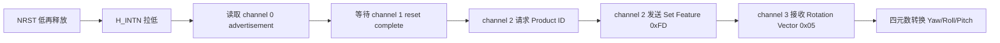

# BNO085 SPI driver for STM32 HAL

一个经过实机验证的 BNO085 SPI/SHTP 驱动示例，运行于 STM32F407ZG，使用
STM32 HAL 和 Keil MDK-ARM。驱动核心不依赖 STM32 HAL；当前工程通过独立 STM32
适配层接入 SPI/GPIO/时基。示例以 100 Hz 同时读取 Rotation Vector 和三轴加速度，
并通过 USART1 持续输出 Yaw、Roll、Pitch。

> 这不是寄存器型 SPI 驱动。BNO085 的主机接口运行 SHTP/SH-2 协议，必须处理
> `H_INTN`/`WAKE` 握手、SHTP 包头、通道序号和 SH-2 启动完成事件。

## 实机状态

- MCU：STM32F407ZGTx
- 传感器：BNO085，part `10004148`
- 固件：`3.2.13`，build `6`
- 工具链：Keil MDK，ARM Compiler 5.06 update 7
- SPI：Mode 3、MSB first、2.625 Mbit/s（84 MHz APB2 / 32）
- 串口：USART1，115200 8-N-1
- 输出速率：Rotation Vector 100 Hz

实测输出：

```text
BNO085 part 10004148, FW 3.2.13, build 6, reset 4
ACC: x=  8.01 y= -2.84 z= -5.02 m/s^2
BNO085 rotation vector and accelerometer running at 100 Hz
YPR: yaw=-100.13 roll=-153.33 pitch=-38.77 deg
YPR: yaw=-100.12 roll=-153.34 pitch=-38.78 deg
```

## 功能

- BNO085 硬件复位与 SPI 模式启动
- 等待 SHTP advertisement 和 SH-2 `reset complete`
- 按通道维护 SHTP sequence number
- Product ID 请求与多响应包接收
- Rotation Vector 和 calibrated accelerometer 的 Set Feature
- 9 轴 Rotation Vector（report ID `0x05`）
- Q14 四元数和 Q12 accuracy estimate 解码
- 同一个 SHTP cargo 内多个 sensor report 的遍历
- 缓冲区不足时仍排空完整设备包，避免后续包错位
- 超时、无响应和非法包检测
- Z-Y-X 欧拉角在驱动中只计算一次并缓存
- Yaw、Roll、Pitch 及 X/Y/Z 加速度的组合与单项 Getter
- 超过 1 秒无 Rotation Vector 数据时自动恢复
- 与 MCU 无关的协议核心和可替换的平台适配层

## 工程结构

```text
BNO085/
├─ BNO085_Driver/
│  ├─ Inc/bno085.h               面向应用的公共 API
│  ├─ Src/bno085.c               与 MCU 无关的 SHTP/SH-2 核心
│  └─ Port/
│     ├─ bno085_port.h           核心所需的硬件接口契约
│     └─ STM32/                  当前 STM32 HAL 适配实现
├─ Core/                         STM32CubeMX 生成代码和应用示例
├─ Drivers/                      STM32 HAL/CMSIS
├─ MDK-ARM/
│  └─ BNO085.uvprojx             Keil 工程
├─ docs/DEBUGGING.zh-CN.md       驱动开发复盘和排错记录
├─ docs/DEVELOPMENT_PROCESS.zh-CN.md 本次实现过程复盘
├─ docs/DRIVER_WALKTHROUGH.zh-CN.md  逐代码教学
├─ docs/PORTING.zh-CN.md         新 MCU 适配指南
├─ docs/RELEASE_CHECKLIST.zh-CN.md   发布前检查表
└─ BNO085.ioc                    STM32CubeMX 配置
```

## 接线

| BNO085 信号 | STM32F407ZG | 说明 |
|---|---:|---|
| H_INTN | PA0 | 低有效的数据就绪/握手输入 |
| NRST | PA1 | 低有效硬件复位 |
| WAKE/PS0 | PA2 | 主机唤醒；复位采样时保持高 |
| CS | PA4 | 软件控制片选 |
| SCK | PA5 | SPI1 SCK |
| MISO | PA6 | SPI1 MISO |
| MOSI | PA7 | SPI1 MOSI |
| UART TX | PA9 | 调试串口输出 |
| GND | GND | 必须共地 |

SPI 模式还要求 PS1 在复位采样时为高，BOOTN 保持高。许多模块已经提供上拉，
但移植到自制板时必须核对原理图。

## 启动顺序



只收到 advertisement 并不代表 SH-2 已经能接受配置。必须等到 executable channel
上的 `reset complete`，否则 Set Feature 可能被静默忽略。

## 编译和运行

1. 使用 Keil 打开 `MDK-ARM/BNO085.uvprojx`。
2. 选择 target `BNO085`，Build 并烧录。
3. 以 115200 8-N-1 打开串口。
4. 上电后先打印 Product ID，随后持续打印 YPR。

应用入口在 `Core/Src/main.c`。核心调用方式（省略错误处理）：

```c
BNO085_STM32_PortConfig_t port;
uint32_t events;
BNO085_Euler_t euler;

port.spi = &hspi1;
/* 继续填写 CS、WAKE、RESET、INT 的 port/pin。 */
BNO085_STM32_Port_Init(&port);
BNO085_Init();

BNO085_EnableAccelerometer(10000U);    /* 100 Hz */
BNO085_EnableRotationVector(10000U);  /* 100 Hz */

if ((BNO085_Poll(200U, &events) == BNO085_OK) &&
    ((events & BNO085_EVENT_ROTATION_VECTOR) != 0U)) {
    BNO085_GetEuler(&euler);
}
```

`BNO085_Poll()` 是唯一的流式 SPI 读取入口。它解析收到的所有报告并更新缓存；
`BNO085_GetYaw()`、`BNO085_GetRoll()`、`BNO085_GetPitch()`、
`BNO085_GetAccelerationX/Y/Z()` 只读缓存，不会各发起一次 SPI 事务。

## 移植与性能

换 MCU 时保留 `Inc/bno085.h`、`Src/bno085.c` 和 `Port/bno085_port.h`，只需重新实现
`bno085_port.h` 中的 8 个接口。当前 STM32 实现在 `Port/STM32`，详细步骤见
[docs/PORTING.zh-CN.md](docs/PORTING.zh-CN.md)。

本次针对流式读取做了这些优化：

- SPI 从 656.25 kHz 提升到 2.625 MHz，仍低于 BNO085 的 3 MHz 上限。
- 读取缓冲由 32 字节小块改为最多 260 字节一次传输，减少 HAL 调用次数。
- 收发缓冲改为静态复用，降低任务栈占用。
- 一个 SHTP cargo 只遍历一次，四元数转欧拉角只计算一次。
- 所有 Getter 直接读同一帧缓存，调用三个角度 API 不会重复通信或出现帧间错位。

当前 UART 调试打印仍是阻塞式的，若应用还要做控制环，建议改成 UART DMA 或只每
5～10 帧打印一次；它比 SPI 读取本身更容易占用 CPU 时间。

### SPI 与 UART-RVC 有多快

UART-RVC 固定为 115200 bit/s、100 Hz、每帧 19 字节。当前 SPI 为 2.625 Mbit/s，
单看物理层比特率约为 UART-RVC 的 **22.8 倍**。UART 的 19 字节采用 8-N-1，在线
时间约 1.65 ms；典型 SPI Rotation Vector SHTP 数据（4 字节头 + 5 字节时间戳 +
14 字节报告）约 23 字节，纯移位时间约 70 us，约短 **23.5 倍**。

但这不等于当前 YPR 更新快 23 倍：两边都输出 100 Hz 时，新姿态仍约每 10 ms 一帧。
SPI 的实际优势是总线占用小、主机读取延迟低、可配置报告种类和频率，并能同时读取
更多 SH-2 输出；UART-RVC 的优势是协议极简单。另需注意 UART-RVC 不能可靠使用
BNO085 内部时钟，硬件必须提供外部 32.768 kHz 时钟或晶振。

## 坐标和精度说明

示例按 Z-Y-X 顺序计算欧拉角：Yaw 绕 Z，Pitch 绕 Y，Roll 绕 X。实际设备的正方向
还取决于 BNO085 在机械结构中的安装方向。

Rotation Vector 的 `accuracy` 状态为 0–3。状态为 0 时仍会产生四元数和 YPR，
但绝对航向不应视为已经校准。如果只需要相对方向且工作环境磁干扰较强，可以考虑
后续增加 Game Rotation Vector（`0x08`）支持；代价是 Yaw 会随时间产生漂移。

## 为什么这个驱动容易写错

本项目遇到的关键问题、错误现象、定位过程和最终修复记录在
[docs/DEBUGGING.zh-CN.md](docs/DEBUGGING.zh-CN.md)。最关键的两个结论是：

1. SPI 读取时 MOSI dummy byte 必须发送 `0x00`，不能发送 `0xFF`。
2. 必须等待 SH-2 `reset complete`，不能在 advertisement 后立即 Set Feature。

## 学习路线

建议按下面顺序阅读：

1. [本次驱动编写流程](docs/DEVELOPMENT_PROCESS.zh-CN.md)：理解问题是怎样被逐层定位的。
2. [逐代码教学](docs/DRIVER_WALKTHROUGH.zh-CN.md)：从 SPI 配置一直跟到 YPR Getter。
3. [排错记录](docs/DEBUGGING.zh-CN.md)：根据串口现象快速定位通信层级。
4. [移植指南](docs/PORTING.zh-CN.md)：为其他 MCU 实现 Port 层。

## 项目状态

项目包含许可证、忽略规则、贡献指南、变更记录、Issue/PR 模板、实机验证记录和
版本发布检查表。提交改动或制作新版本前，请按
[发布检查表](docs/RELEASE_CHECKLIST.zh-CN.md)逐项确认。当前编译、下载和串口证据见
[实机验证记录](docs/VALIDATION.zh-CN.md)。

## 参考资料

- [CEVA BNO08X Datasheet](https://www.ceva-ip.com/wp-content/uploads/BNO080_085-Datasheet.pdf)
- [CEVA Sensor Hub Transport Protocol](https://www.ceva-ip.com/wp-content/uploads/Sensor-Hub-Transport-Protocol.pdf)
- [CEVA SH-2 reference implementation](https://github.com/ceva-dsp/sh2)
- [CEVA STM32/Nucleo demo](https://github.com/ceva-dsp/sh2-demo-nucleo)
- [CEVA BNO08X calibration procedure](https://www.ceva-ip.com/wp-content/uploads/2019/09/BNO080-BNO085-Sesnor-Calibration-Procedure.pdf)

## 许可证

本项目原创驱动和示例修改采用 BSD-3-Clause。STM32 HAL、CMSIS 和其他第三方代码
保留各自目录中的原许可证与版权声明。
